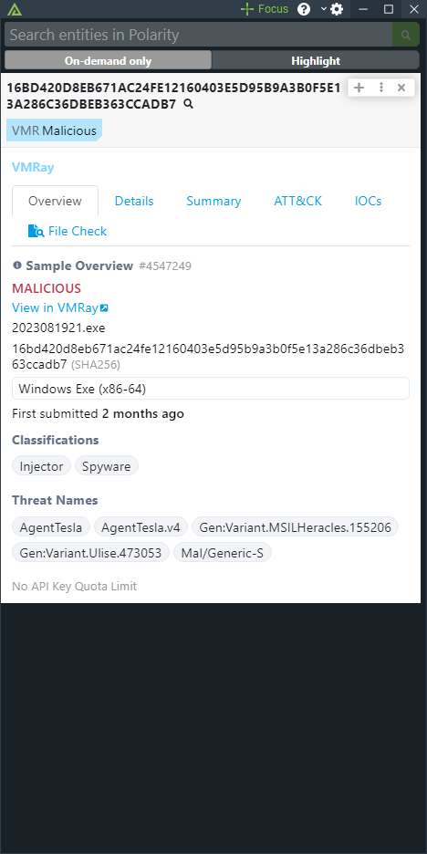
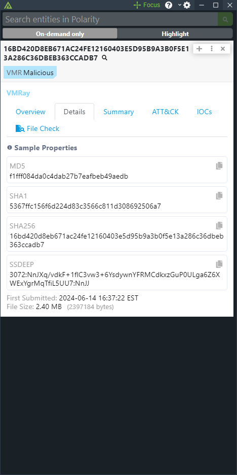
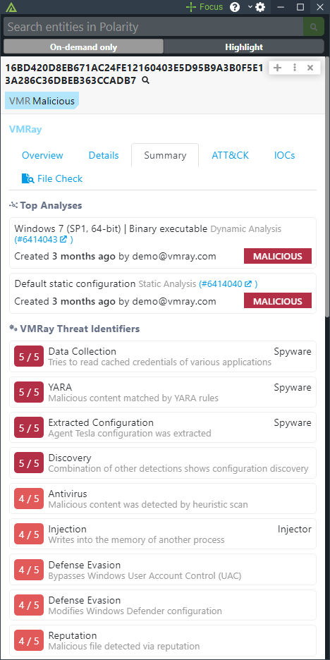
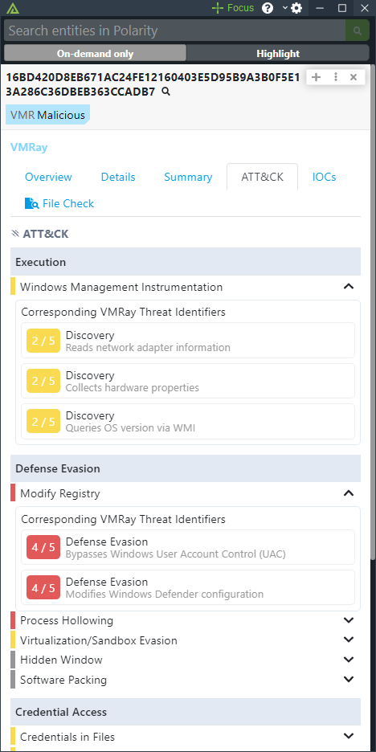
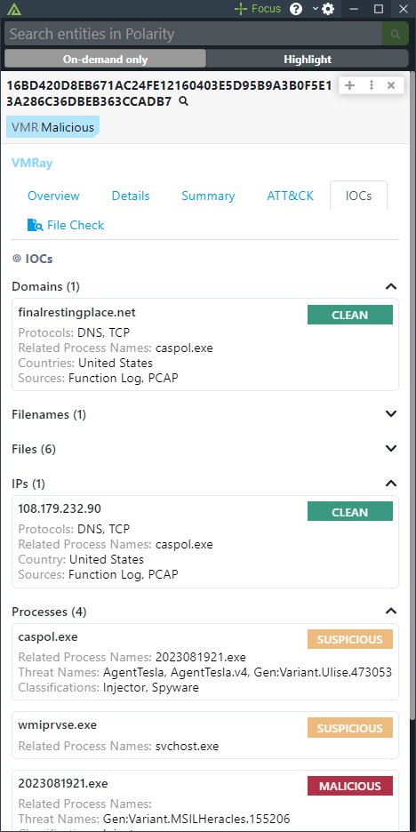
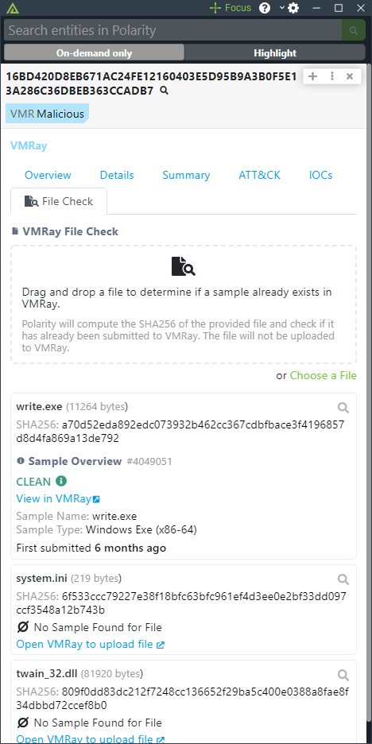

# Polarity - VMRay Integration

The Polarity VMRay integration supports looking up Sample information by hash (MD5, SHA1, SHA256).  Additionally, it includes a "File Check" capability where you can drag and drop a file into the Overlay Window to locally compute a SHA256 hash which is then checked against VMRay for a valid Sample. 

For more information on VMRay, please visit [official website](https://www.vmray.com).

|    |    |  
|:-----------------------------------------:|:---------------------------------------:|:-------------------------------------:|
|           *Sample Overview Tab*           |          *Sample Details Tab*           |         *Sample Summary Tab*          |
|               |                 |    
| :---------------------------------------: | :-------------------------------------: |                 :---:                 |
|         *Sample Mitre ATT&CK Tab*         |            *Sample IOCs Tab*            |           *File Check Tab*            |

## File Check

The Polarity VMRay integration includes a "File Check" capability that computes the SHA256 of a local file and then checks the resultant SHA256 for a valid Sample in VMRay.  The "File Check" capability does not upload the file to VMRay and computes the SHA256 locally.

## VMRay Integration Options

### VMRay URL
The base URL of your hosted or Cloud based VMRay instance including the schema (i.e., https://). For example, "https://us.cloud.vmray.com" or "https://eu.cloud.vmray.com".

### API Key
A valid VMRay API Key

### Return result when no sample is found
If checked, the integration will return a result even when no Sample could be found for the given hash.

## Installation Instructions

Installation instructions for integrations are provided on the [PolarityIO GitHub Page](https://polarityio.github.io/).

## Polarity

Polarity is a memory-augmentation platform that improves and accelerates analyst decision making.  For more information about the Polarity platform please see:

https://polarity.io/
